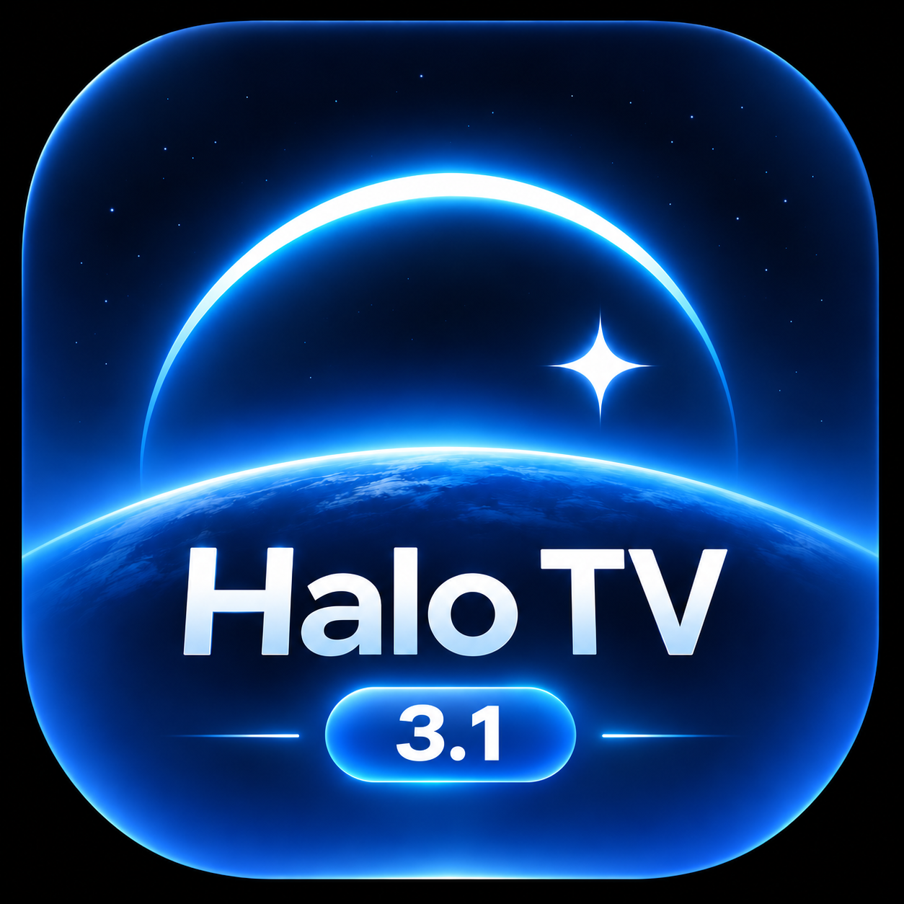

<h1 align="center">HaloTV · 3.2.7 正式版</h1>

让电视桌面，回到你喜欢的样子。

<a href="https://halo-tv.pages.dev/">官方网站</a> · <a href="https://github.com/Null9797/halo-tv/releases/tag/v3.2.7-halo">3.2.7 正式版</a> · <a href="https://github.com/Null9797/halo-tv/releases/latest">最新正式版</a> · <a href="INSTALL.md">安装教程</a>

**HaloTV 基于 [Aerial](https://github.com/pengchujin/aerial-tv) 二次开发，由 Null_ 整理发布，非 Aerial 原作者或官方发行版。感谢原作者和所有开源贡献者。保留原版权与 MIT 许可，免费分享。**

## 3.2.7 正式发布

修复关闭儿童／长辈模式后，保留的家长密码让应用列表“设置”循环验证、造成卡死的问题；增强系统设置和原桌面的启动保护。公告点“知道了／不再提醒”后完成，控制中心不再显示已完成公告；其他未读及稍后提醒的公告继续保留入口。

Standard / Guard 内部号 **229**，Lite **85**。沿用独立包名与发布签名，可覆盖同类型独立版及本轮测试包（228 / 84），保留数据、Logo 和启动图。继续沿用此前整合的 Aerial 1.98 基础，保留紧凑 Dock。

三个 Release 构建及 **1,111 项主机测试**通过，Lint 无 Error/Fatal（仍有警告），签名与安装包完整性检查通过。设置修复已在 TCL MT5879 的 228 测试包验证；3.2.7 重新升版构建，未逐机验证。[完整更新与验证范围](docs/releases/RELEASE-3.2.7.md)

## 下载

**3.2.7 已进入正式在线更新通道：官网下载优先，GitHub 备用。也可手动下载覆盖安装。**

| 类型 | 官网下载 | GitHub 备用 | 适用范围 |
|---|---|---|---|
| Standard | [下载](https://halo-tv.pages.dev/updates/HaloTV-3.2.7-standard.apk) | [下载](https://github.com/Null9797/halo-tv/releases/download/v3.2.7-halo/HaloTV-3.2.7-standard.apk) | Android 5.0+，优先尝试 |
| Guard | [下载](https://halo-tv.pages.dev/updates/HaloTV-3.2.7-guard.apk) | [下载](https://github.com/Null9797/halo-tv/releases/download/v3.2.7-halo/HaloTV-3.2.7-guard.apk) | Android 5.0+，限制第三方 HOME 的固件可尝试 |
| Lite | [下载](https://halo-tv.pages.dev/updates/HaloTV-3.2.7-lite.apk) | [下载](https://github.com/Null9797/halo-tv/releases/download/v3.2.7-halo/HaloTV-3.2.7-lite.apk) | Android 4.0+，老设备；不含完整版动态桌面 |

Standard 与 Guard 同包名、二选一；升级选择与当前一致的类型。Lite 使用另一包名。安装新版独立版时保留现有应用数据，无需先卸载。

## 独立版与使用说明

从 3.2.4 起已移除旧版/过渡版配置导入，不再维护跨包迁移流程。旧版本说明仅作为历史资料保留；旧包名不能通过新 APK 原地覆盖。独立版可以与 Aerial 共存，系统权限和私有数据各自独立。请勿同时启用两个桌面守护。

- 玻璃 Dock、大/小圆弧图标、经典玻璃滑动焦点与自定义图标。
- 可调整位置的时间、日期、农历和天气，翻页时钟及屏保。
- 儿童应用名单、观看限额与趣味答题；长辈大图标和休息提醒。
- 手机同网扫码管理、上传素材与验证后的更新包推送。
- 在线更新、性能模式及常用系统入口；具体能力受电视系统限制。

3.0 系列实机素材展示现有功能；部分画面保留采集时的版本编号，实际外观依用户设置而定。

[安装教程](INSTALL.md) · [常见问题](FAQ.md) · [守护诊断工具](docs/HALO_GUARD_TOOL.md) · [累计更新记录](RELEASE_NOTES.md)

厂商对默认桌面、开机启动和无障碍守护的限制不同，不能保证所有电视零闪烁或守护永久有效。请按当前独立包名配置权限；不要用上游 Aerial 的安装脚本给 HaloTV 授权。

## 开源与致谢

- 基于 [pengchujin/aerial-tv](https://github.com/pengchujin/aerial-tv)，感谢 Aerial 原作者和贡献者；保留 [LICENSE](LICENSE) 与 [NOTICE](NOTICE.md)。
- Bing 壁纸归档由 [YanGN](https://github.com/ygnstudio/bing_wallpaper_archive) 提供。
- 在线视频目录参考 [Aerial Views](https://github.com/theothernt/AerialViews)，视频来自 Apple；媒体版权归各权利人，代码许可不代替素材授权。
- 与 Aerial 原作者、Apple、电视厂商无隶属或背书关系。
- [3.2.7 完整应用源码](https://github.com/Null9797/halo-tv/releases/download/v3.2.7-halo/HaloTV-3.2.7-source.zip) · [3.2.7 文件校验值](docs/releases/SHA256SUMS-3.2.7.txt)。不公开签名私钥。

完整源码与安装包放在 [Releases](https://github.com/Null9797/halo-tv/releases)，历史版本仍可查阅；[文档目录](docs/README.md) 汇总说明。

[官方网站](https://halo-tv.pages.dev/) · [网盘](https://pan.quark.cn/s/a14e3ab2dd41)（实际内容以网盘为准）
